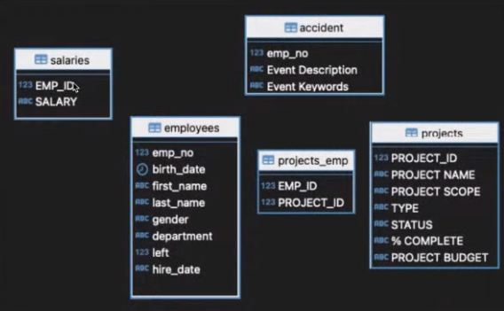
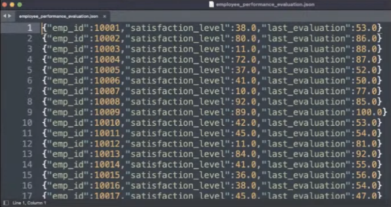
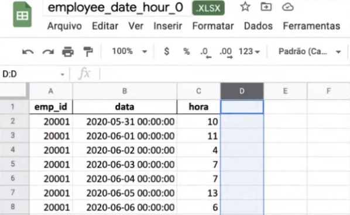
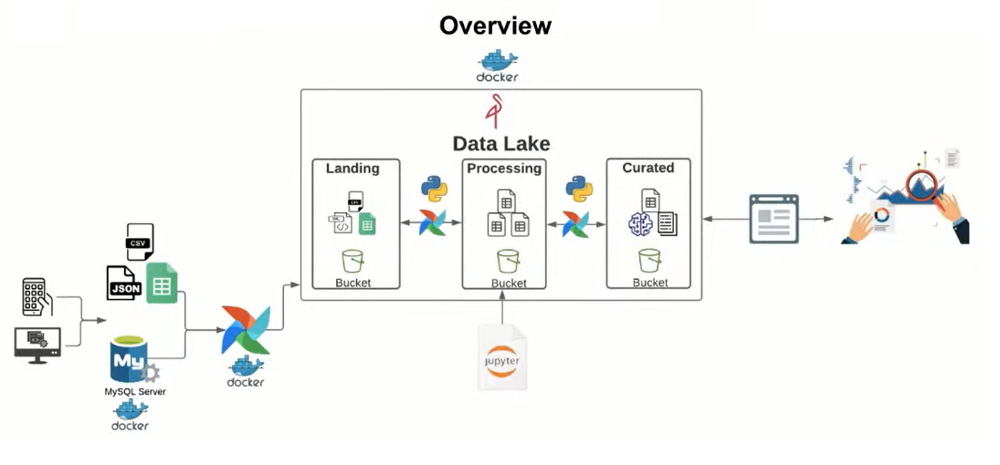
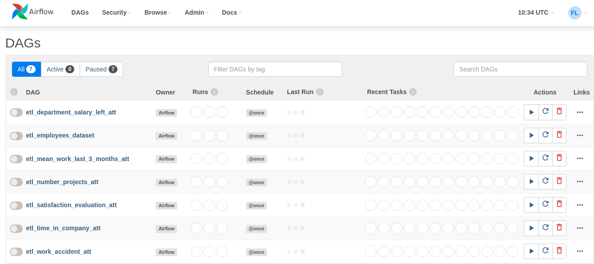
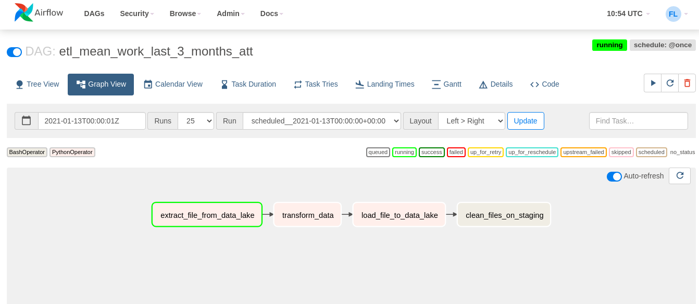
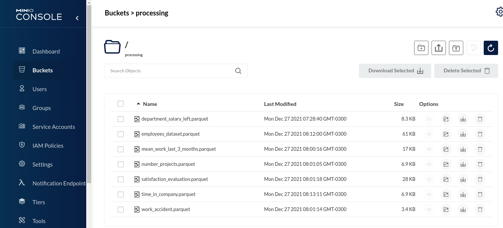
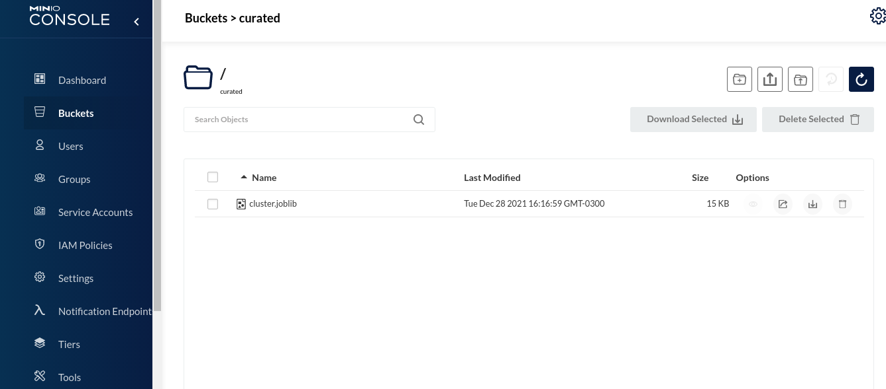
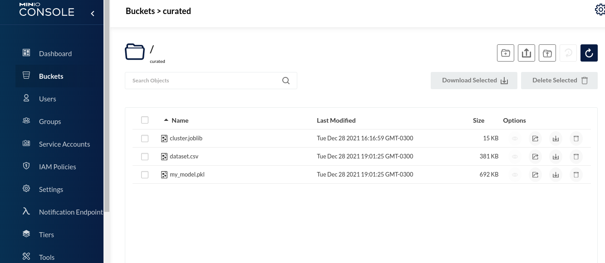

# Turnover Project

> O **Turnover Project** nos dar um feedback baseado em *Estatísticas* e uma modelagem de *Machine Learning* sobre quais funcionários podem deixar a empresa futuramente.

## Visão geral sobre o Projeto

 - [Introdução & Problema](#intro-problem)
 - [De onde vem os dados?](#data-source)
 - [Overview da nossa solução](#overview)
 - [Processo (implementação) de ETL](#etl-process)
 - [Limpeza, Manipulação & Preparação dos Dados](#clean-prepare)
 - [Processo de modelagem (Machine Learning)](#machine-learning)
 - [Tecnologias (ferramentas) utilizadas](#tech)

---

## Introdução & Problema

Bem, não sei se vocês já sabem, mas é muito *difícil (e caro)* uma empresa contratar um profissional que atenda aos requisitos da mesma. Por isso, é muito interessante que quando contratado o profissional permaneça o máximo de tempo possível na empresa.

> **Mas como impedir (ou tentar) que esses profissionais saiam da empresa?**

Esse é o problema que nós vamos tentar resolver nesse projeto.

 - **Para resolver esse problema, nós vamos ter que responder várias questões como:**
   - Quais fatores influenciam para um colaborador deixar a empresa?
   - Como reter esses colaboradores?
   - Podemos nos antecipar e saber se um determinado colaborador vai sair (ou tentar) da empresa?
   - Como diminuir o **turnover**?
     - **Turnover:** Turnover significa a taxa de rotatividade de colaboradores em uma empresa. Ou seja, o número de novos colaboradores comparado àqueles profissionais que deixam o ambiente de trabalho.

---

## De onde vem os dados?

### 1° - MySQL

Uma das fontes, onde, nós vamos pegar informações sobre os funcionários vai ser em um *Banco de Dados MySQL*. Algo parecido com isso:

### 2° - Avaliação de desempenho dos funcionários (Formato JSON)

Outra fonte de dados para nós relacionada com os funcionários vai ser uma *avaliação* de uma empresa terceirizada que nós diz o nível de:

 - Satisfação do funcionário na empresa;
 - E também nós da uma avaliação geral sobre esse funcionário:
   - Ou seja, quão bem esse funcionário foi avaliado (em porcentagem).

Algo parecido com isso:

  

### 3° - Horas trabalhadas por dia para cada funcionário (Planilha Excel)

Por fim, uma das nossas fontes de dados é uma *planilha do Excel* que armazena dados referentes a horas trabalhadas por cada funcionário na empresa. Algo parecido com isso:

  

---

## Overview da nossa solução

É muito interessante nos termos um **Overview da nossa solução** de forma *visual*. Isso, porque em alguns casos nós vamos precisar mostrar nossa solução para os *Gestores* ou *Stakeholders* do projeto.

A forma visual é quase sempre a melhor alternativa de visualização. O nosso **Overview visual** é o seguinte:

  

**NOTE:**  
Veja que no nosso **Overview** nós temos as *etapas* e *tecnologias* utilizadas em cada etapa bem definidas.

---

## Processo (implementação) de ETL

> Antes de iniciar o *processo (implementação)* de **ETL** foi feito um Pré-Processamento e modelagem dos dados.

**NOTE:**  
Você pode ver e entender esse processo clicando no seguinte **Jupyter Notebook**:

**[→ data_model.ipynb](notebooks/data_model.ipynb)**  

Depois de pensado e planejado como seria implementadas nossas *DAGs* com *Apache Airflow* nós implementamos os seguintes códigos:

**airflow/dags**  
[etl_department_salary_left_att.py](airflow/dags/etl_department_salary_left_att.py)  
[etl_employees_dataset.py](airflow/dags/etl_employees_dataset.py)  
[etl_mean_work_last_3_months_att.py](airflow/dags/etl_mean_work_last_3_months_att.py)  
[etl_number_projects_att.py](airflow/dags/etl_number_projects_att.py)  
[etl_satisfaction_evaluation_att.py](airflow/dags/etl_satisfaction_evaluation_att.py)  
[etl_time_in_company_att.py](airflow/dags/etl_time_in_company_att.py)  
[etl_work_accident_att.py](airflow/dags/etl_work_accident_att.py)  

**NOTE:**  
Essas DAGs já foram mapeadas com o nosso *Apache Airflow* na hora da criação do container. Se você se conectar no Servidor Web do Apache Airflow terá o seguinte resultado:

  

As **DAGs** foram enviadas automaticamente para o nosso container docker com Apache Airflow. Agora é só executar nossas DAGs para iniciar o processo de **ETL**.

**NOTE:**  
Vale salientar que a **DAG [etl_employees_dataset.py](airflow/dags/etl_employees_dataset.py)** é responsável por juntar e concatenar todos os dados. Por isso, ela deve ser a **última DAG a ser executada**.

Outro ponto interessante aqui é que se você clica em uma DAG em execução (por exemplo: etl_mean_work_last_3_months_att.py) e clicar em **Graph View** você pode visualizar em qual tarefa sua DAG está:

  

Visto que todas as **DAGs** obtiveram sucesso, todos os dados foram enviados para o *Data Lake (MinIO)* para a *zona (butcket)* processing:

  

---

# Pré-Processamento & Análise dos Dados

Nessa etapa do projeto foi feito um **Pré-Processamento** & **Análise dos dados**. Se você tiver interesse em *ver* e *entender* como foi feito esse processo, basta clicar na referência para o *Jupyter Notebook* abaixo:

**[→ preprocessing-data-analysis.ipynb](notebooks/preprocessing-data-analysis.ipynb)**  

**NOTE:**  
Lembrando que no fim dessa etapa foi enviado para a *zona (butcket)* **curated** do nosso *Data Lake (MinIO)* um **Cluster** do nosso conjunto de dados:

---

## Processo de modelagem (Machine Learning)

Nessa etapa do projeto foi implementado e testado modelos de Machine Learning com a finalidade de descobrir qual se adequa melhor com o nosso conjunto de dados.

Novamente, se você tiver interesse em *ver* e *entender* como foi feito esse processo, basta clicar na referência para o *Jupyter Notebook* abaixo:

**[→ machine_learning_deploy.ipynb](notebooks/machine_learning_deploy.ipynb)**  

**NOTE:**  
Novamente, nós utilizamos nosso Data Lake (MinIO) para armazenar nosso modelo - zona (bucket) **curated**:

  

**NOTE**  
Veja que além de enviarmos nosso modelo, nós também enviamos um dataset do nosso conjunto de dados pronto para produção.

---

## Tecnologias (ferramentas) utilizadas

Durante o desenvolvimento desse projeto foi utilizado as seguintes tecnologias (ferramentas):

 - **Docker com:**
   - MySQL
   - MinIO
   - Apache Airflow
 - **Jupyter Notebook**
 - **Python com as seguintes bibliotecas:**
   - PyMySQL
   - Openpyxl
   - Pandas
   - Datetime
   - Glob
   - Math
   - SQLAlchemy
   - MinIO
   - Fastparquet
   - seaborn
   - sweetviz
   - Scikit-Learn
   - Pycaret
 - **Streamlit para visualização da solução.**

---

**Rodrigo Leite -** *drigols*
